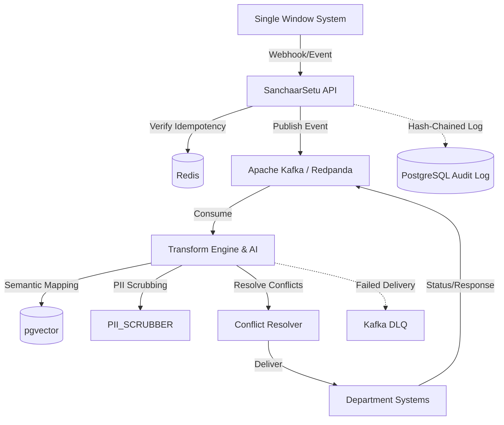

# SanchaarSetu: Complete Documentation

## 1. Executive Summary
**SanchaarSetu** (Sanskrit: _sanchaar_ = communication, _setu_ = bridge) is an AI-powered bidirectional interoperability layer for Karnataka's government systems. 

### The Problem
Karnataka's Single Window System (SWS) acts as the central portal for businesses. However, over 40 individual government departments (Labour, Fire Safety, Municipal Corporation, etc.) run separate legacy IT systems. When a business updates its registered address in one place, the other systems have no idea, causing a massive "split-brain" data consistency problem. 

### The Solution
SanchaarSetu sits as the middleware layer between the central SWS and the legacy department systems. It detects data changes, transforms heterogeneous field schemas using AI, resolves simultaneous data conflicts, and securely syncs records across all departments—maintaining a cryptographically secure audit trail. It uses a **non-invasive Adapter Pattern**, meaning it works without requiring any legacy systems to rewrite their source code.

---

## 2. High-Level Architecture



### Ingestion Tiers
Department systems connect via three tiers depending on their technological maturity:
- **Tier 1 (Webhook)**: Real-time (<1s latency). Used for modern APIs.
- **Tier 2 (Polling)**: 1–15 min latency. Used for read-only APIs.
- **Tier 3 (Snapshot)**: Hourly/Nightly CDC. Used for legacy databases.

---

## 3. Core Features & Technology Stack

### Tech Stack
- **Frontend:** React 18, TypeScript, Vite, Tailwind CSS, GraphSentinel Design System (Enterprise light-mode native, `Inter` + `Caveat` fonts).
- **Backend API:** Python, FastAPI (Async).
- **Message Broker:** Apache Kafka / Redpanda.
- **Database:** PostgreSQL with `pgvector` (Mappings & Audit) and Redis (Idempotency).
- **AI/ML:** `SentenceTransformers` (`all-MiniLM-L6-v2`) for semantic mapping.

### Key Features
- **Idempotency**: Redis-backed deduplication (at-least-once semantics).
- **Semantic Schema Mapping**: AI-based automatic field matching, cached in `pgvector`.
- **Conflict Detection & Resolution**: Configurable policies (SWS-wins, last-write-wins, manual-review).
- **Audit Trail**: Append-only Postgres log with **Tamper-Evident Hash Chaining**.
- **Message Queue**: Durable at-least-once delivery with **Exponential Backoff & Dead Letter Queues (DLQ)**.
- **Security & Privacy**: Regex PII Scrubbing, Role-Based Access Control (RBAC), and Rate Limiting.

---

## 4. Key Components Deep Dive

### 1. Webhook Listener (`/sws/webhook`)
Accepts events in real-time. Generates an idempotency key `SHA256(UBID:event_type:timestamp_window)` and performs an atomic `SETNX` in Redis to reject duplicates. Produces the event to Kafka.

### 2. Kafka Message Queue
Provides durable, ordered event propagation via the `sanchaar-events` topic. Guarantees at-least-once delivery. If delivery fails, it uses exponential backoff (2s, 4s, 8s, 16s). After 4 failures, messages are routed to the Dead Letter Queue (`sanchaar-dlq`).

### 3. Transform Engine (`transform.py`)
Automatically maps fields between heterogeneous schemas.
1. Scrubs PII (PAN, Aadhaar, Phone, Email).
2. Encodes incoming fields with SentenceTransformers.
3. Compares against target schema fields via cosine similarity.
4. If confidence > 0.85, auto-maps. If <0.85, sends to manual review.
5. Caches mappings permanently in `pgvector`.

### 4. Conflict Resolver (`conflicts.py`)
Monitors Kafka for updates to the same UBID within a 60-second window. Policies include:
- **SWS-wins**: SWS payload is authoritative.
- **Last-write-wins**: Later timestamp wins (for memo fields).
- **Manual-review**: Both held for human decision (PAN, GSTIN).

### 5. Audit Store (`init.sql`)
An immutable, append-only log. Every new record queries the `chained_hash` of the previous record, concatenates the new data, and generates a new SHA256 hash. This guarantees cryptographically secure tamper-evidence.

---

## 5. User Interface (Pages)

- **Dashboard (`Dashboard.tsx`)**: Live KPIs (total events, success rate, latency, active conflicts, pending mappings). Includes a synthetic event simulator.
- **Event Feed (`EventFeed.tsx`)**: Real-time streaming view of updates flowing through Kafka. Click rows to inspect payload hashes and outcomes.
- **Conflict Resolver (`ConflictResolver.tsx`)**: Operator queue for data disagreements. Shows conflicting values side-by-side with 1-click batch resolution.
- **Schema Mappings (`SchemaMappings.tsx`)**: The AI's brain. Displays confidence scores. Operators can confirm, reject, or manually override translations.
- **Audit Trail (`AuditTrail.tsx`)**: The tamper-evident log. No `DELETE` or `UPDATE` allowed. Exportable to CSV.
- **Departments (`Departments.tsx`)**: Health management for all 40+ systems. Operators can toggle a "Circuit Breaker" to pause delivery to degraded systems.

---

## 6. Core Workflow Example (Address Change)

1. **Trigger**: Business updates address on SWS. Webhook fires to SanchaarSetu.
2. **Idempotency**: Redis checks `hash("U123:addr_update:16839792")`. If unique, proceeds.
3. **Queue**: Payload is published to Kafka.
4. **Transform**: Payload (`{address: "123 MG Rd"}`) is semantically matched to target schema (`{registered_address: "123 MG Rd"}`).
5. **Conflict**: Checked against 60-second window. No conflict found.
6. **Delivery**: Sent to the Department API. (Retries via Exponential Backoff if offline).
7. **Audit**: Hash-chained record written to PostgreSQL.

---

## 7. Scalability & Impact

- **Scalability**: All processing components (Transform, Conflict) are completely stateless. By relying strictly on Kafka, Redis, and Postgres, horizontal scaling via Kubernetes is trivial.
- **Feasibility**: Rapid onboarding. AI reduces department onboarding from weeks (hardcoding schemas) to hours.
- **Impact for Citizens**: Businesses only register their details once. A single update in SWS seamlessly and securely propagates everywhere, eradicating split-brain bureaucracy.

---

## 8. Getting Started

### Prerequisites
- Docker & Docker Compose
- Node.js (for frontend UI)
- Python 3.11+ (for testing scripts)

### Run Full Stack
```bash
cd sanchaarsetu_demo
docker-compose up --build -d
```
Services will start on:
- API: `http://localhost:8000`
- Frontend UI: `http://localhost:5173`

### End-to-End Testing
```bash
cd sanchaarsetu_demo
pip install requests

# Run all demo tests covering conflicts, idempotency, and routing
python test_e2e.py
```

---

## 9. Project Directory Structure

```text
sanchaarsetu_demo/
├── app/                        # Backend Application (Python/FastAPI)
│   ├── full_main.py            # Main API server, Kafka consumer, and Routing logic
│   ├── transform.py            # AI Semantic Mapping & PII Scrubbing Engine
│   ├── conflicts.py            # Conflict Detection & Policy Rules Engine
│   └── detection.py            # Polling & CDC logic for Legacy DBs
├── db/                         # Database Configurations
│   └── init.sql                # PostgreSQL Schema (Audit, Mappings, pgvector)
├── frontend/                   # Frontend User Interface (React/Vite)
│   ├── src/
│   │   ├── components/         # Reusable UI elements (Sidebar, Layout)
│   │   ├── pages/              # Main Dashboard views
│   │   │   ├── Dashboard.tsx   # KPI and Metrics overview
│   │   │   ├── Departments.tsx # Legacy system connection manager
│   │   │   ├── SchemaMappings.tsx # AI translation review interface
│   │   │   ├── ConflictResolver.tsx # Conflict resolution interface
│   │   │   ├── EventFeed.tsx   # Real-time Kafka stream view
│   │   │   └── AuditTrail.tsx  # Hash-chained compliance log
│   │   ├── index.css           # GraphSentinel Design System CSS + Fonts
│   │   └── App.tsx             # React Router configuration
│   ├── Dockerfile              # Containerizes the Frontend UI
│   ├── package.json            # Node.js dependencies
│   └── tailwind.config.js      # Styling tokens and custom animations
├── Dockerfile                  # Containerizes the Backend API
├── docker-compose.yml          # Master orchestration for API, UI, Postgres, Redis, Redpanda
├── test_e2e.py                 # Automated End-to-End Test Suite
├── inspect_db.py               # CLI Utility to view DB records easily
└── requirements.txt            # Python dependencies (FastAPI, sentence-transformers, etc.)
```
