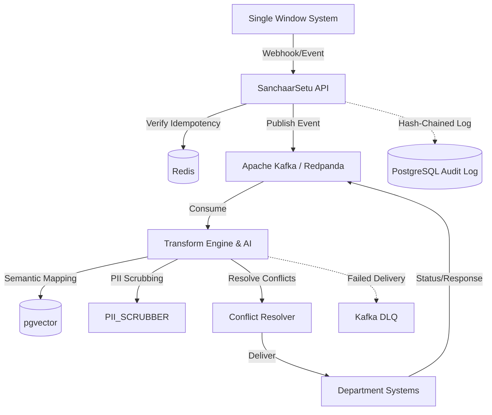

# SanchaarSetu: AI for Bharat 2026 Submission Document

## 1. Architecture Diagram

## 2. Tech Stack
- **Frontend**: React, Vite, Tailwind CSS, GraphSentinel Design System (Enterprise light-mode native, `Inter` + `Caveat` fonts).
- **Backend API**: Python, FastAPI (Async).
- **Message Broker**: Apache Kafka / Redpanda (Enabling at-least-once delivery, Dead Letter Queues, and exponential backoff).
- **Database (Relational & Vector)**: PostgreSQL with `pgvector` for storing semantic mappings and tamper-evident audit logs.
- **Cache & Idempotency**: Redis.
- **AI & ML**: SentenceTransformers (`all-MiniLM-L6-v2`) for semantic schema mapping.

## 3. What Page Does What (UI Overview)
- **Dashboard (`Dashboard.tsx`)**: High-level overview of propagation health, active conflicts, pending AI mappings, and system uptime metrics.
- **Departments (`Departments.tsx`)**: Displays all 40+ onboarded legacy systems categorized by their ingestion tier (Webhook, Polling, Snapshot). Allows operators to manually override connection statuses.
- **Schema Mappings (`SchemaMappings.tsx`)**: The AI's brain. Displays how SWS fields are mapped to Department fields. Fields with >0.85 confidence are auto-mapped; others are queued for human review here.
- **Conflict Resolver (`ConflictResolver.tsx`)**: Shows instances where SWS and a Department received conflicting updates within a 60-second window. Operators can manually resolve high-stakes conflicts (e.g., PAN, GSTIN).
- **Event Feed (`EventFeed.tsx`)**: A real-time, live-streaming view of all updates flowing through the Kafka queues in both directions.
- **Audit Trail (`AuditTrail.tsx`)**: The tamper-evident, append-only log. Shows cryptographic proof of every payload delivered, retry attempted, and conflict resolved.

## 4. Core Workflow (SWS to Department Example)
1. **Event Triggered**: A business updates its address on SWS. SWS fires a webhook to SanchaarSetu.
2. **Idempotency Check**: SanchaarSetu generates a unique hash and checks Redis to ensure this exact event hasn't been processed already.
3. **Queueing**: The payload is pushed to Kafka (`sanchaar-events`).
4. **AI Transformation**: The Transform Engine scrubs PII, uses SentenceTransformers to find the correct field in the target Department's schema (e.g., `address` -> `registered_address`), and formats the payload.
5. **Conflict Check**: The system checks if the Department also updated this UBID recently. If yes, it applies a resolution policy (e.g., SWS-wins).
6. **Delivery & Backoff**: The payload is sent to the Department. If the API is down, it enters an **Exponential Backoff** retry loop (2s, 4s, 8s, 16s). If it fails 4 times, it goes to the **Dead Letter Queue (DLQ)**.
7. **Audit**: A hash-chained, immutable record is written to PostgreSQL to permanently prove the state change.

## 5. Scalability
- **Horizontal Scaling**: Every component is independently scalable. If webhook traffic spikes, FastAPI instances can scale up. If processing lags, Kafka consumer groups can be expanded.
- **Stateless Processing**: The core engines (Transform, Conflict) are completely stateless, relying strictly on Redis and Postgres for state, making Kubernetes auto-scaling trivial.

## 6. Feasibility
- **Non-Invasive Adapter Pattern**: Highly feasible because it treats all 40+ legacy systems as black boxes. It never modifies their source code, avoiding massive bureaucratic migrations.
- **Rapid Onboarding**: The use of AI for semantic mapping reduces onboarding time for a new department from weeks (hardcoding schemas) to mere hours (confirming AI predictions).

## 7. Impact
- **Eradicates Split-Brain Data**: Ensures a single source of truth across all government departments.
- **Citizen Centric**: Businesses no longer have to update their details in 40 different portals. One update in SWS seamlessly propagates everywhere.
- **Secure & Auditable**: Tamper-evident hash-chaining prevents internal data manipulation, while PII scrubbing ensures sensitive data isn't exposed to LLMs.
